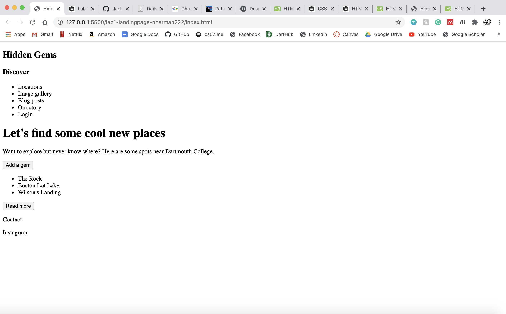
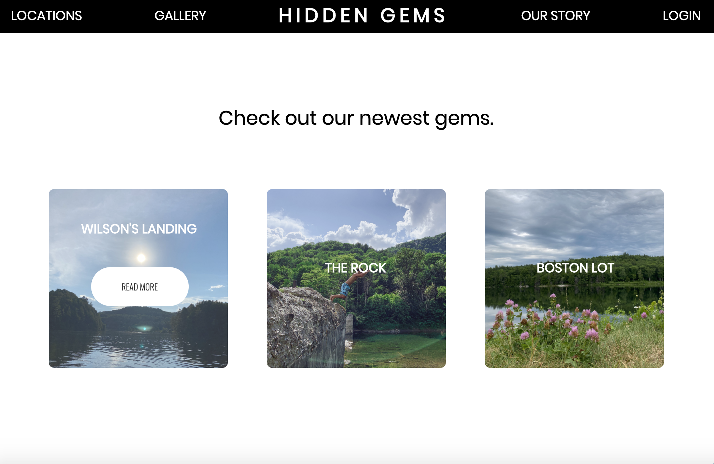
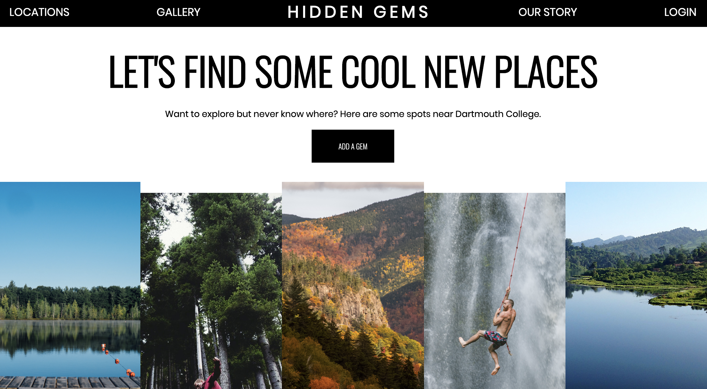
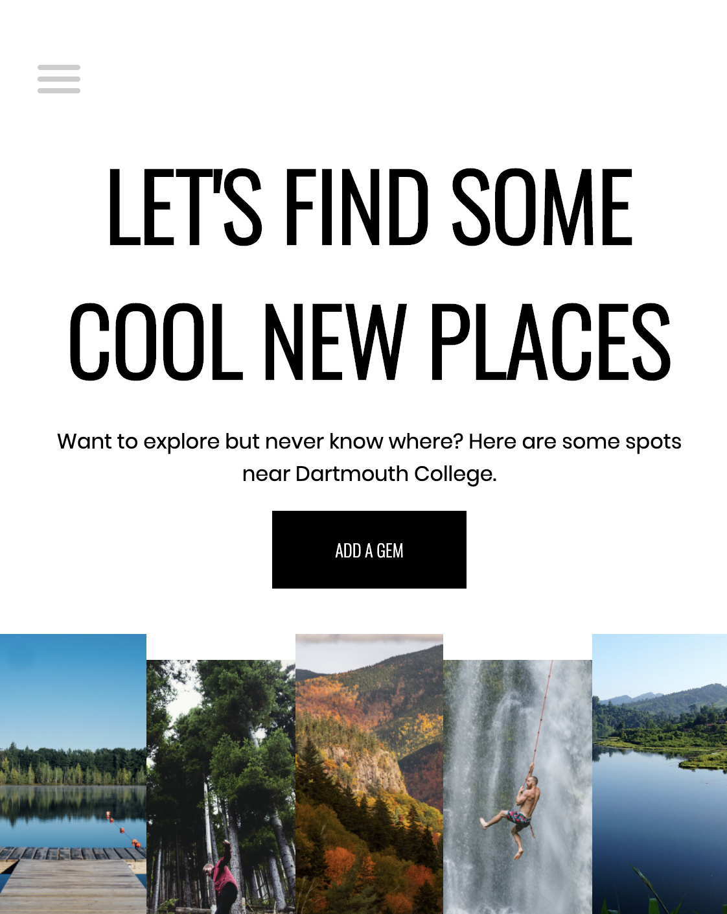

# Landing Page

I created my landing page based off of https://www.daily-harvest.com/ and one portion based off of https://www.patagonia.com/home/.
The one portion that was based off of https://www.patagonia.com/home/ is the "Check out our newest gems" section of example images.

For extra credit I added the mobile menu checkbox hack.

[https://dartmouth-cs52-20x.github.io/lab1-landingpage-nherman222/](https://dartmouth-cs52-20x.github.io/lab1-landingpage-nherman222/)

## What Worked Well

My main button expands when hovering on it and the main images are staggered just as the Daily Harvest website does. The footer also replicates the footer (which includes the email sign up form) from the Daily Harvest website with underlines appearing when hovering over the links. Additionally, I was able to make a responsive nav bar that turns into a hamburger bar menu when in mobile and I made the nav bar sticky to the top of the screen.
The "Checkout the newest gems" section was inspired by the Patagonia shopping carousel because (I thought) it looked better than the Daily Harvest layout for that area. When you hover over the images in this section, the opacity of the image is turned down, and a "read more" button appears.

## What Didn't

I was going to layer the main images with the "Let's find some cool places" wording and the button using a z-index but the only reason that looked good on the Daily Harvest website was because the images had white backgrounds so I didn't end up doing that. There is a small range for which the main letters and images do not resize because the position of the "Checkout the newest gems" is absolute.

## Screenshots

### HTML

### Hovering over left image:

### Normal view:

### Mobile view:

