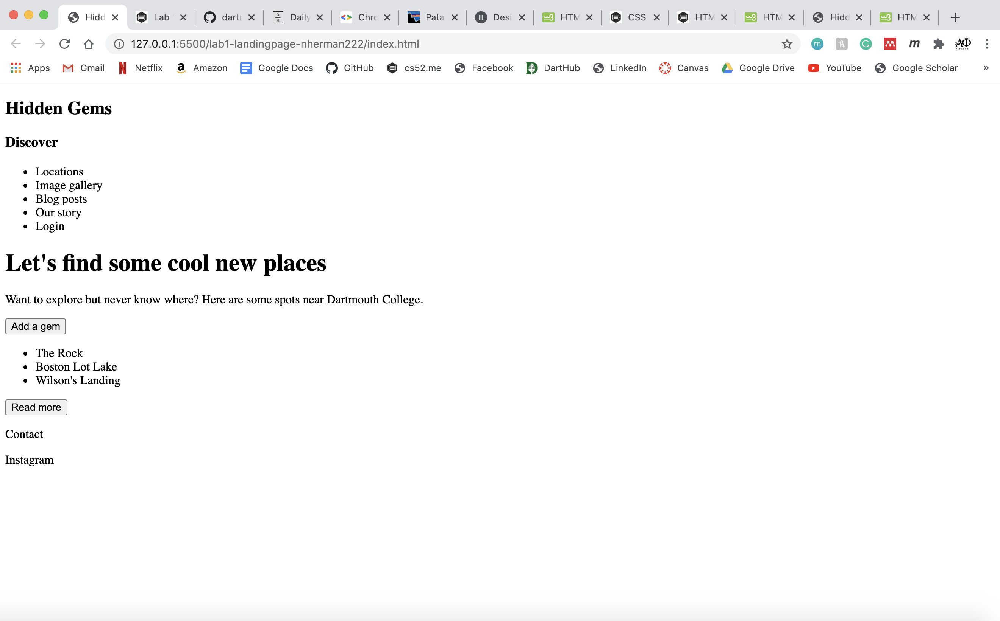

# Landing Page

_description_
I created my landing page based off of https://www.daily-harvest.com/ and one portion based off of https://www.patagonia.com/home/.
The one portion that was based off of https://www.patagonia.com/home/ is the "Check out our newest gems" section of example images.

For extra credit I added the mobile menu checkbox hack.

[https://dartmouth-cs52-20x.github.io/lab1-landingpage-nherman222/](https://dartmouth-cs52-20x.github.io/lab1-landingpage-nherman222/)

## What Worked Well

I was able to make a responsive nav bar that turns into a hamburger bar menu when in mobile. My main button transforms

## What Didn't

## Screenshots

